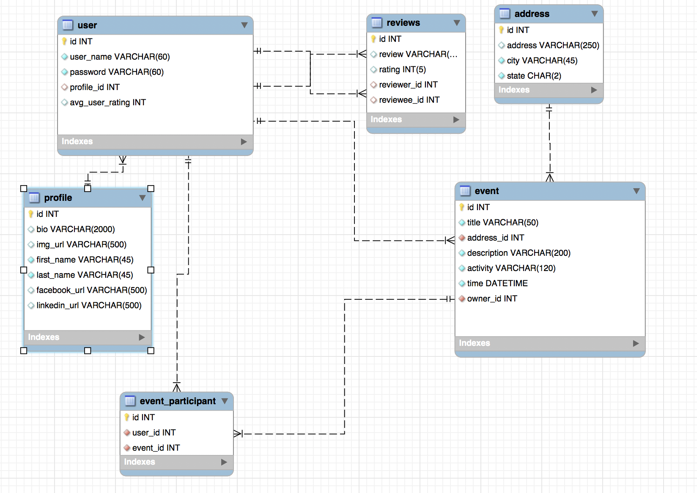
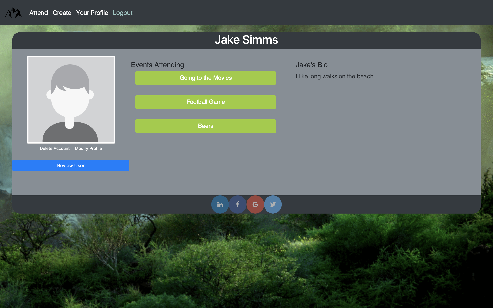
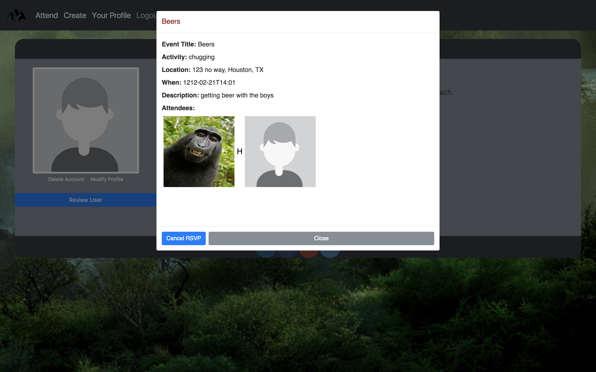

Modjül  - Event Planning Web Application

This was a midterm assignment for Skill Distillery Full-Stack Java Coding Program

GROUP: Dave Chirdon, Aaron Ipp, Jake Simms, David Stumpe, Jen Veigel

The Application

Have an extra ticket to the Avalanche, but no friends available to invite? Want to go see "Imagine Dragons" but your SO only likes jazz? Don't miss out. Use Modjül to find a pal or pals to go with! With Modjül, you can post events to find friends to go with or find posted events to attend.

Users can:
 - Create an Account
 - Login
 - View Posted events and choose to attend them
 - Create there own events
 - Edit there profile to display information about themselves
 - View profiles of other users
 - Search through the list of all events
 - Update and Delete an event they created
 - Cancel there RSVP to an event

Technologies used:
 - JAVA		
 - JPA
 - MVC
 - JSP
 - MYSQL

Database Schema

The first landing page is the login screen.

By clicking create account user is lead to page with forms to create account
which updates the mysql users table.

Once you login you lead to the main page with three options

Create brings you to the create event page

Attend Event brings you to a page to view all listed events and attend them if you choose

Each users profile looks like this

When you click details on an event entry it displays a modal with information about that events and other users
who are attending

